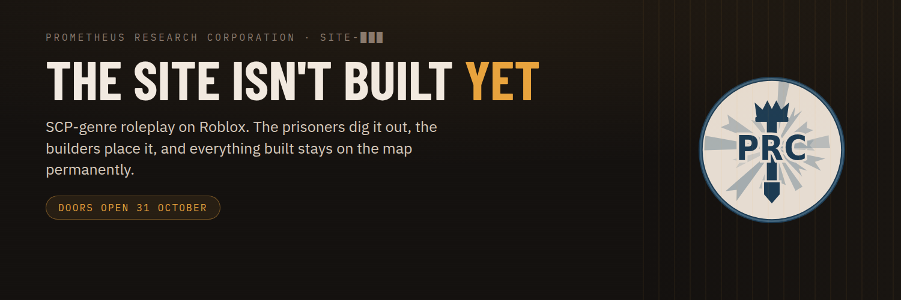

<p align="center">
  
</p>

<h3 align="center">A roleplay group on Roblox where the site genuinely isn't built yet</h3>

<p align="center">
  <a href="https://prcblacksite.github.io/"><b>Site</b></a> &nbsp;·&nbsp;
  <a href="https://prcblacksite.github.io/orientation.html"><b>Start here</b></a> &nbsp;·&nbsp;
  <a href="https://discord.gg/RjzQN8kCPW"><b>Discord</b></a> &nbsp;·&nbsp;
  <a href="https://www.roblox.com/communities/16632422"><b>Roblox</b></a>
</p>

---

The headline is literal. On day one there's a supply pier, a prison camp, and a hole in the side
of a mountain. Everything else gets dug out of the ground and built by the people playing.

**Prisoners dig.** They work the rock face and haul what they break out to the skip. Every stud of
this place starts as somebody swinging a tool.

**Facilities build what gets dug.** Engineering put actual buildings on the live map. Logistics
drive the truck, work the docks, and keep the stores full.

**Nothing resets.** A bar fills as everybody digs, and when it fills a whole new part of the site
opens up for everyone, for good. Floor 2 doesn't exist until somebody digs it out.

```
████████░░░░░░░░   41.2%   ▲ +1.8% / 24h

DUG         412 t to the skip
BUILT       6 modules placed
NEXT NODE   Wire, north run    68%
```

### Five departments

Go with whatever you'd actually enjoy doing on a Tuesday night rather than whatever sounds most
important. Nobody is stuck where they start.

| | |
|---|---|
| **Administrative** | The office. Sign people in, keep the records, write up whatever went wrong. |
| **Facilities** | Put buildings on the map that stay there, and run the supply line that feeds them. |
| **Security** | The guards. Gates, escorts, head counts, and the riot when it kicks off. |
| **Mobile Vanguard** | Most nights you do nothing at all. Then the alarm goes. Ten seats, selection only. |
| **Detainee Labour** | The prisoners. No application, no interview. You could be digging in about a minute. |

Ranks are six steps and they're the same six everywhere, so a Foreman in Facilities and a Sergeant
in Security are the same level and nobody has to argue about who's in charge. Starting as a
prisoner doesn't leave you stuck either: three clean shifts gets you Trusty, and serving your time
lets you walk into any department you like.

### Where things stand

Discord is open now. The doors open on **31 October 2026**, and everybody who joins before then
keeps a Founder rank that never gets handed out again.

<sub>Something below the fourth floor has been here longer than any of us.</sub>
